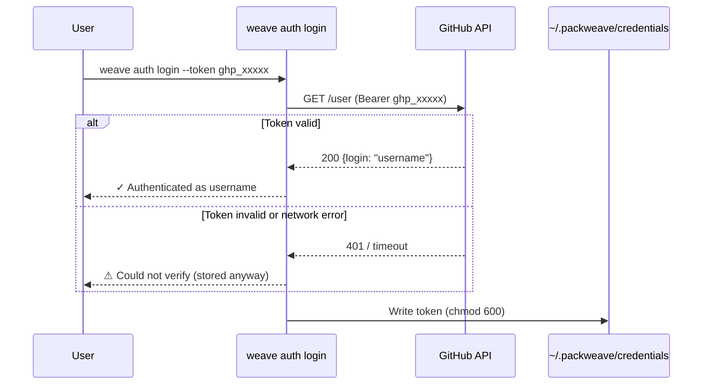
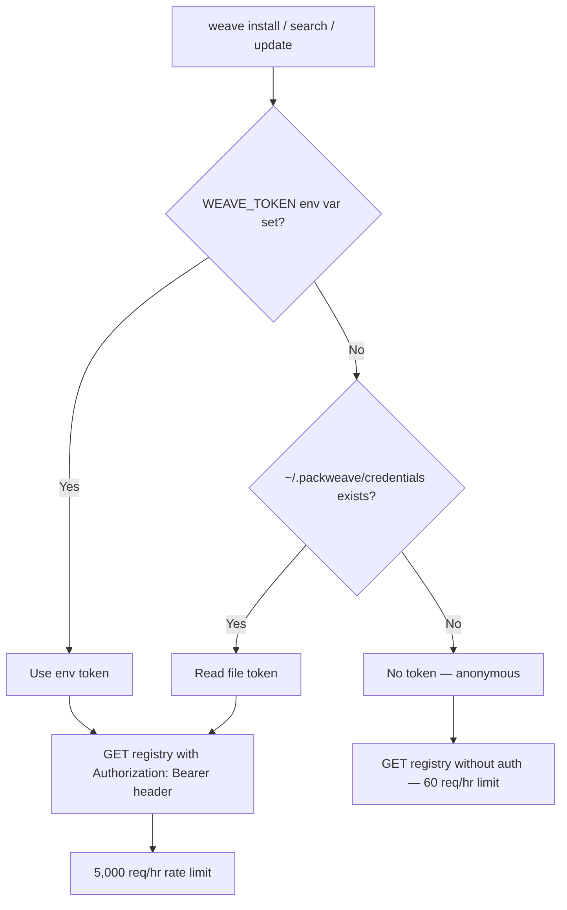

# Registry Protocol

This document is the authoritative specification for the PackWeave registry protocol. It is intended for contributors, alternative registry operators, and AI assistants working in this codebase.

---

## Overview

The pack registry is a GitHub-hosted repository (`PackWeave/registry`) that serves pack metadata and file content. It is separate from MCP server registries (like the official MCP Registry or Smithery) — weave packs are composable bundles of MCP server configuration, system prompts, slash commands, and settings, not individual MCP server listings.

The registry uses a two-tier sparse index so clients never download more than they need. Pack content is embedded directly in `packs/{name}.json` as a flat map of relative path → file content — no tarballs, no release artifacts, no SHA256 ceremony.

---

## Repository Structure

```
PackWeave/registry/
├── index.json              Lightweight search catalog
├── packs/
│   └── {name}.json         Full metadata + inline file content per pack
├── src/
│   └── {name}/
│       ├── pack.toml       Canonical pack source — reviewed by maintainers
│       ├── prompts/
│       ├── commands/
│       ├── skills/
│       └── settings/
├── TEMPLATE/               Starter template for contributors
│   └── pack.toml
├── README.md
└── CONTRIBUTING.md
```

A GitHub Actions workflow automatically regenerates `packs/{name}.json` and `index.json` from `src/` on every merge to main. Contributors only ever touch files under `src/`.

---

## Sparse Index Protocol

### Tier 1 — `index.json` (lightweight catalog)

Fetched once for `weave search` and `weave list`. Contains only what is needed to display results — no version arrays, no file content.

**URL:** `{registry_base_url}/index.json`

**Format:** A flat JSON object mapping pack names to their listing.

```json
{
  "filesystem": {
    "name": "filesystem",
    "description": "Read and write local files via the MCP filesystem server",
    "keywords": ["filesystem", "files", "mcp"],
    "latest_version": "0.1.0"
  },
  "github": {
    "name": "github",
    "description": "GitHub repos, issues, pull requests, and code search via MCP",
    "keywords": ["github", "git", "mcp"],
    "latest_version": "0.1.0"
  }
}
```

The client fetches this file once and caches it in-process for the lifetime of the command. It is never written to disk.

### Tier 2 — `packs/{name}.json` (per-pack metadata + content)

Fetched on demand when installing or resolving a specific pack. Contains all versions and their complete file content inline.

**URL:** `{registry_base_url}/packs/{name}.json`

**Format:** A `PackMetadata` object.

```json
{
  "name": "filesystem",
  "description": "Read and write local files via the MCP filesystem server",
  "authors": ["PackWeave"],
  "license": "MIT",
  "repository": "https://github.com/PackWeave/registry",
  "keywords": ["filesystem", "files", "mcp"],
  "versions": [
    {
      "version": "0.1.0",
      "dependencies": {},
      "files": {
        "pack.toml": "[pack]\nname = \"filesystem\"\n...",
        "prompts/system.md": "# System prompt content...",
        "commands/review.md": "# Review command..."
      }
    }
  ]
}
```

`files` is a flat map of relative path → file content. The store writes each entry directly to `~/.packweave/packs/{name}/{version}/` — no tarball download, no SHA256 verification step. Trust is provided by TLS and GitHub as the content host.

The client caches this per-pack after the first fetch for the lifetime of the command.

### Data Flow — `weave install`

```
weave install filesystem
        │
        ├─ resolve token (WEAVE_TOKEN env → credentials file → None)
        │
        ├─ GET {base}/packs/filesystem.json
        │   ├─ Authorization: Bearer <token>  (if authenticated)
        │   └─ {versions: [{version, files, dependencies}]}
        │
        ├─ resolve: pick version satisfying constraints
        │
        ├─ write files from release.files to ~/.packweave/packs/filesystem/0.1.0/
        │   (path-validated: no .., no absolute paths)
        │
        └─ apply to installed CLIs
```

### Data Flow — `weave search`

```
weave search filesystem
        │
        ├─ resolve token (WEAVE_TOKEN env → credentials file → None)
        │
        ├─ GET {base}/index.json  [cached after first call]
        │   ├─ Authorization: Bearer <token>  (if authenticated)
        │   └─ {filesystem: {description, latest_version}, ...}
        │
        ├─ filter by "filesystem" (name, description, keywords)
        │
        └─ print results
```

---

## Configuration

The client reads `registry_url` from `~/.packweave/config.toml`. This is the **base URL** — the client appends `/index.json` and `/packs/{name}.json` paths itself.

The `WEAVE_REGISTRY_URL` environment variable overrides `registry_url` (used by E2E tests).

Default: `https://raw.githubusercontent.com/PackWeave/registry/main`

---

## Authentication

### When is authentication needed?

| Use case | Auth required? | Why |
|----------|---------------|-----|
| `weave install`, `search`, `update` | No (recommended) | The registry is public, but authenticated requests get 5,000 req/hr instead of 60 |
| `weave publish` | **Yes** | Pushes pack content to the registry repository via the GitHub API |
| Private/self-hosted registries | Depends | The registry operator decides; weave sends the token as a `Bearer` header on all requests |

### Token lifecycle



**Step by step:**

1. **User creates a GitHub PAT** at [github.com/settings/tokens](https://github.com/settings/tokens)
   - For publishing: needs `contents:write` on `PackWeave/registry`
   - For rate limits only: any valid token works (no special scopes needed)
2. **`weave auth login --token ghp_xxxxx`** — validates against GitHub API (best-effort), writes to `~/.packweave/credentials`
3. **All subsequent commands** automatically include `Authorization: Bearer` in registry HTTP requests
4. **`weave auth logout`** — deletes the credentials file

### Token resolution and request flow



### Token resolution order

When weave needs a token, it checks these sources in order:

1. **`WEAVE_TOKEN` environment variable** — highest priority, never written to disk. Use this in CI/automation.
2. **`~/.packweave/credentials` file** — written by `weave auth login`. Plain text, single token, restricted to owner-only permissions (0o600) on Unix.
3. **`config.toml` → `auth_token_path`** — optional override for the credentials file path. Useful for custom setups or testing. Does not contain the token itself.

If none of these exist, requests are sent without authentication (anonymous).

### For alternative registries

The token is sent as `Authorization: Bearer <token>` on every HTTP GET to the registry. Alternative registry operators can use this for access control. The `validate_github_token` check on login is GitHub-specific and advisory — it does not prevent storing tokens intended for other registries.

---

## Pack Format — `pack.toml`

Every pack must contain a `pack.toml` at its root. The canonical format uses a `[pack]` section header for pack metadata, with `[[servers]]`, `[targets]`, `[dependencies]`, and `[extensions.*]` as top-level TOML sections.

```toml
[pack]
# Required
name = "my-pack"              # Unique identifier: lowercase letters, digits, hyphens only
version = "0.1.0"             # Semver
description = "..."           # One sentence

# Recommended
authors = ["Name <email>"]
license = "MIT"
repository = "https://github.com/..."
keywords = ["keyword1", "keyword2"]

# Optional
min_tool_version = "0.4.0"   # Minimum weave version required to use this pack

# MCP servers (zero or more [[servers]] blocks)
[[servers]]
name = "server-name"         # Must be globally unique across all installed packs
command = "npx"              # Executable for stdio transport
args = ["-y", "@org/pkg@1.2.3"]
transport = "stdio"          # "stdio" (default) or "http"

# For HTTP/SSE transport, use url instead of command/args:
# url = "https://your-server.example.com/mcp"
# headers = { Authorization = "Bearer ${API_KEY}" }

# Optional: expose only a subset of the server's tools
tools = ["tool1", "tool2"]

# Declare required environment variables (never store values here)
[servers.env.API_KEY]
required = true
secret = true
description = "Your API key — get one at https://example.com"

# Target CLIs (omit this section entirely to target all supported CLIs)
[targets]
claude_code = true
gemini_cli = true
codex_cli = true

# CLI-specific settings merged non-destructively into the CLI's settings file
[extensions.claude_code]
# Any valid Claude Code settings JSON fragment
```

---

## Pack File Layout

The `files` map in `packs/{name}.json` mirrors the source layout under `src/{name}/`. All paths are relative; no leading `/`; no `..` components.

```
pack.toml                        Required — the manifest
prompts/claude.md                Optional — appended to Claude Code's CLAUDE.md
prompts/gemini.md                Optional — appended to Gemini CLI's GEMINI.md
prompts/codex.md                 Optional — appended to Codex CLI's AGENTS.md
prompts/system.md                Optional — fallback prompt when CLI-specific file is absent
commands/{name}.md               Optional — slash commands for Claude Code
skills/{name}.md                 Optional — skill files for Codex CLI
settings/claude.json             Optional — deep-merged into ~/.claude/settings.json
settings/gemini.json             Optional — deep-merged into ~/.gemini/settings.json
settings/codex.toml              Optional — merged into ~/.codex/config.toml
```

All content is plain text (TOML, JSON, Markdown) — no binaries. MCP server code lives on npm/PyPI/GitHub and is fetched at runtime by the CLI; weave only distributes the configuration that points at it.

---

## Running an Alternative Registry

Any HTTP server that serves the two endpoints below is a valid registry:

| Endpoint | Content |
|----------|---------|
| `GET /index.json` | Lightweight catalog: `HashMap<name, {name, description, keywords, latest_version}>` |
| `GET /packs/{name}.json` | Full metadata with inline `files` content |

To point weave at an alternative registry:

```toml
# ~/.packweave/config.toml
registry_url = "https://your-registry.example.com"
```

Or for a single command:

```sh
WEAVE_REGISTRY_URL=https://your-registry.example.com weave search mypack
```

---

## JSON Schemas

### `index.json`

```json
{
  "<pack-name>": {
    "name": "string",
    "description": "string",
    "keywords": ["string"],
    "latest_version": "semver string"
  }
}
```

### `packs/{name}.json`

```json
{
  "name": "string",
  "description": "string",
  "authors": ["string"],
  "license": "string | null",
  "repository": "string | null",
  "keywords": ["string"],
  "versions": [
    {
      "version": "semver string",
      "dependencies": {
        "<pack-name>": "semver requirement string"
      },
      "files": {
        "<relative-path>": "file content string"
      }
    }
  ]
}
```

All fields with `null` or array defaults may be omitted from JSON responses; the client uses `#[serde(default)]`.
